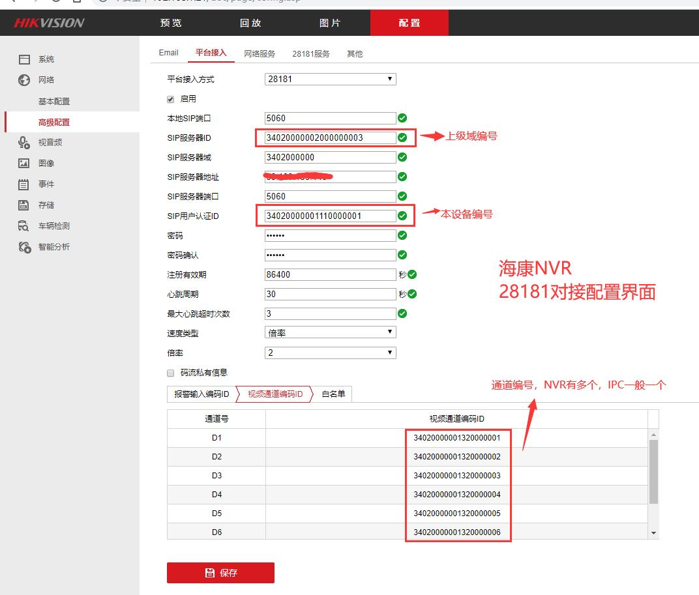
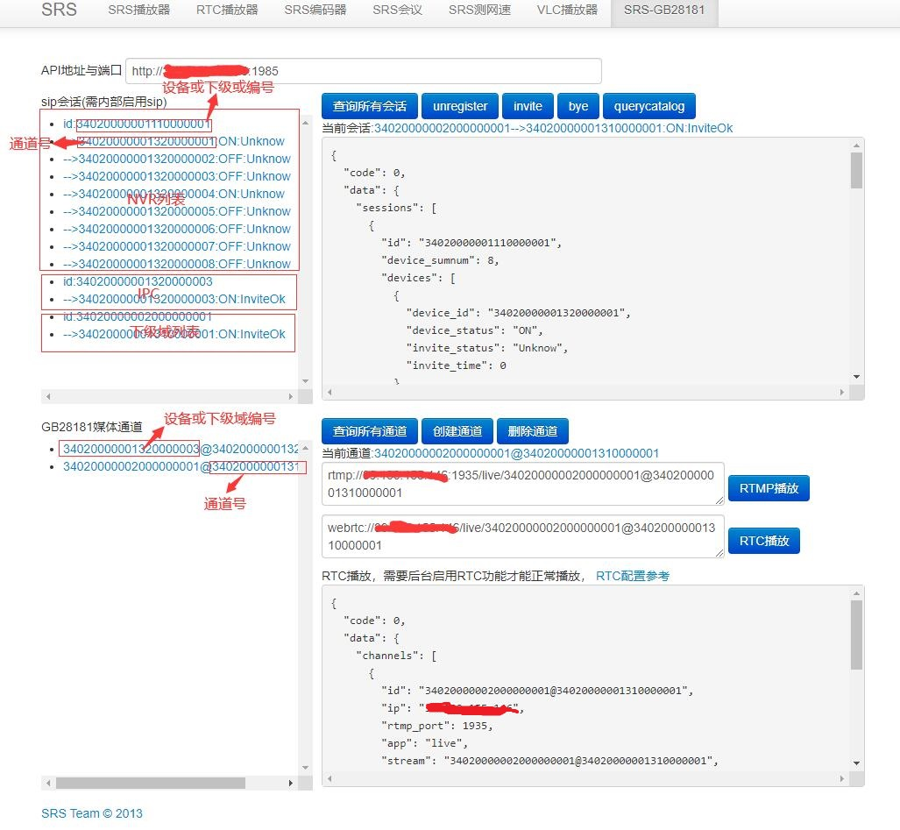
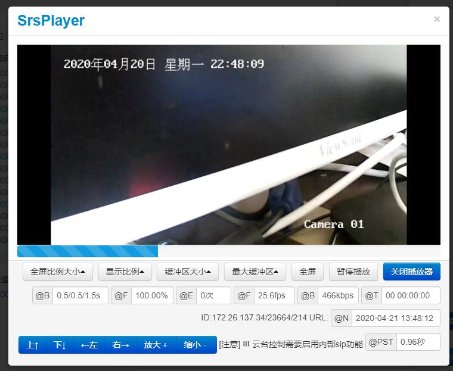
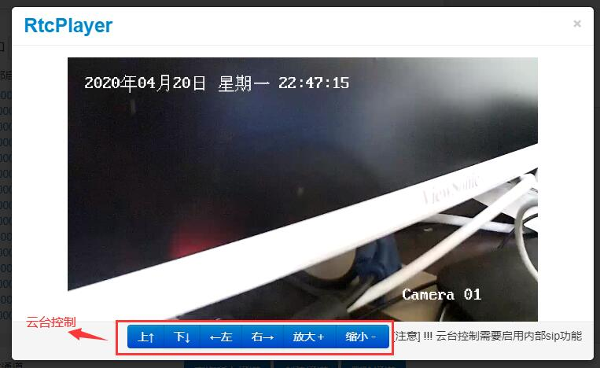

## SRS GB28181  
  SRS GB28181 可对接标准的GB28181 IPC, NVR,以及GB28181下级域平台，内置了GB28181常用sip信令。也可以不启用sip信令，只接收GB28181的PS流。可根据实际情况灵活配置。   
### 接入方式
#### 1. sip 信令与媒体
  在SRS内部实现了gb28181常用的信令，可以对接GB28181 IPC, NVR,以及28181下级域平台. 实现register, message, invite,bye. query caltalog, ptz等信令    
   **register:** 注册设备，可ipc, nvc, 下级28181平台  
   **message:** 设备心跳  
   **invite:** 请求设备发流  
   **bye:** 停止设备发流  
   **query caltalog:** 查询设备列表，也就是媒体通道信息  
   **ptz:** 云台控制消息
#### 2.仅接收28181媒体流
   停用内置sip功能，只接收28181设备或平台的媒体流数据，然后转换成rtmp流输出，接收媒体流可以使用一个固定端口，或者随机分配端口，
随机分配需要调用api接口才可以。 使用固定端口推流时，设备端推流需要确定ssrc是唯一的，内部根据ssrc自动创建媒体通道。媒体通道可通过api接口来控制，也可以让系统自动生成媒体通道，默认是关闭自动生成。

###   编译安装运行与配置  
####   编译运行与设备接入配置参考   
[https://github.com/ossrs/srs/issues/1500](https://github.com/ossrs/srs/issues/1500)  
[https://mp.weixin.qq.com/s/VIPSPaBB5suUk7_I2oOkMw](https://mp.weixin.qq.com/s/VIPSPaBB5suUk7_I2oOkMw)

####  海康NVR配置界面

####  大华IPC配置界面

#### 三方GB28181平台（下级域）对接界面

####  SRS-GB28181相关参数配置
默认配置在 conf/push.gb28281.conf
  
	listen                  1935;
	max_connections         1000;
	daemon                  off;
	srs_log_tank            console;
	
	http_api {
	    enabled         on;
	    listen          1985;
	}   
	
	stats {
	    network         0;
	}
	
	stream_caster {
	    enabled             on;
	    caster              gb28181;
	
	    # 转发流到rtmp服务器地址与端口
	    # TODO: https://github.com/ossrs/srs/pull/1679/files#r400875104
	    # [stream] is VideoChannelCodecID(视频通道编号ID) for sip
	    # 自动创建的道通[stream] 是‘chid[ssrc]’ [ssrc]是rtp的ssrc
	    # [ssrc] rtp中的ssrc
	    output              rtmp://127.0.0.1:1935/live/[stream];
	    
	    # 接收设备端rtp流的多路复用端口
	    listen              9000;
	
	    # rtp接收监听端口范围，最小值
	    rtp_port_min        58200;
	    # rtp接收监听端口范围，最大值
	    rtp_port_max        58300;
	
	    # 是否等待关键帧之后，再转发，
	    # off:不需等待，直接转发
	    # on:等第一个关键帧后，再转发
	    wait_keyframe       off;
	    
	    # rtp包空闲等待时间，如果指定时间没有收到任何包
	    # rtp监听连接自动停止，发送BYE命令
	    rtp_idle_timeout    30;
	
	    # 是否转发音频流
	    # 目前只支持aac格式，所以需要设备支持aac格式
	    # on:转发音频
	    # off:不转发音频，只有视频
	    # *注意*!!!:flv 只支持11025  22050  44100 三种
	    # 如果设备端没有三种中任何一个，转发时为自动选择一种格式
	    # 同时也会将adts的头封装在flv aac raw数据中
	    # 这样的话播放器为自动通过adts头自动选择采样频率
	    # 像ffplay, vlc都可以，但是flash是没有声音，
	    # 因为flash,只支持11025 22050 44100
	    audio_enable        off;
	
	    # 服务器主机号，可以域名或ip地址
	    # 也就是设备端将媒体发送的地址，如果是服务器是内外网
	    # 需要写外网地址，
	    # 调用api创建stream session时返回ip地址也是host
	    # $CANDIDATE 是系统环境变量，从环境变量获取地址，如果没有配置，用*
	    # *代表指定stats network 的网卡号地址，如果没有配置network，默认则是第0号网卡地址
	    # TODO: https://github.com/ossrs/srs/pull/1679/files#r400917594
	    host       $CANDIDATE;
	
	    #根据收到ps rtp包自带创建rtmp媒体通道，不需要api接口创建
	    #rtmp地址参数[stream] 就是通道id  格式chid[ssrc]
	    auto_create_channel   off;
	
	    sip {
	        # 是否启用srs内部sip信令
	        # 为on信令走srs, off 只转发ps流
	        enabled on;
	        
	        # sip监听udp端口
	        listen              5060;
	        
	        # SIP server ID(SIP服务器ID).
	        # 设备端配置编号需要与该值一致，否则无法注册
	        serial              34020000002000000001;
	
	        # SIP server domain(SIP服务器域)
	        realm               3402000000;
	
	        # 服务端发送ack后，接收回应的超时时间，单位为秒
	        # 如果指定时间没有回应，认为失败
	        ack_timeout         30;
	
	        # 设备心跳维持时间，如果指定时间内(秒）没有接收一个心跳
	        # 认为设备离线
	        keepalive_timeout   120;
	
	        # 注册之后是否自动给设备端发送invite
	        # on: 是  off 不是，需要通过api控制
	        auto_play           on;
	        # 设备将流发送的端口，是否固定
	        # on 发送流到多路复用端口 如9000
	        # off 自动从rtp_mix_port - rtp_max_port 之间的值中
	        # 选一个可以用的端口
	        invite_port_fixed     on;
	
	        # 向设备或下级域查询设备列表的间隔，单位(秒)
	        # 默认60秒
	        query_catalog_interval  60;
	    }
	}
	vhost __defaultVhost__ {
	}
	
	
	如果启用rtc播放需要将rtc加下配置中
	将下面的内容加下配置项， vhost __defaultVhost__需要替换不能有两个
	
	rtc_server {
	    enabled         on;
	    # Listen at udp://8000
	    listen          8000;
	    #
	    # The $CANDIDATE means fetch from env, if not configed, use * as default.
	    #
	    # The * means retrieving server IP automatically, from all network interfaces,
	    # @see https://github.com/ossrs/srs/issues/307#issuecomment-599028124
	    candidate      $CANDIDATE;
	}
	
	vhost __defaultVhost__ {
	    rtc {
	           enabled     on;
	           bframe      discard;
	    }
	}

###   SRS-GB28181 WEB DEMO
srs提供一个简单GB28181功能演示web页面，可以对接查看sip会话，查询设备列表，请求设备推流，停止推流等。也可以看查媒体通道播放流。web页面是通过SRS Gb28181提供api实现。  
#### 演示界面

#### RTMP播放

#### RTC播放

####  web demo配置
demo页面源代码位置srs/trunk/research/players/srs_ gb28281.html  
需要将web服务器的根指向srs/trunk/research/players目录下。   
下面以ubuntu nginx为例
打开nginx配置 不同系统配置可能不一样，如果不太了解nginx配置，可百度下nginx配置  
如下/etc/nginx/sites-available/default  

	 server {
	        listen 80 default_server;
	        listen [::]:80 default_server;
	
	        # SSL configuration
	        #
	        # listen 443 ssl default_server;
	        # listen [::]:443 ssl default_server;
	        #
	        # Note: You should disable gzip for SSL traffic.
	        # See: https://bugs.debian.org/773332
	        #
	        # Read up on ssl_ciphers to ensure a secure configuration.
	        # See: https://bugs.debian.org/765782
	        #
	        # Self signed certs generated by the ssl-cert package
	        # Don't use them in a production server!
	        #
	        # include snippets/snakeoil.conf;
	
	        root /home/xlx/prj/srs/trunk/research/players;
	
	        # Add index.php to the list if you are using PHP
	        index index.html index.htm index.nginx-debian.html;
配置后保存退出 nginx -s reload 重新加载配置生效
在浏览器中地址输入 http://ip:port/srs_gb28181.html 就可以打开上面的演示界面

###  SRS-GB28181 API

#### SIP API

**1.** sip_query _session 查询sip会话  

    URL: http://192.168.1.17:1985/api/v1/gb28181?action=sip_query_session
	方式: GET
	参数:
	     id: 可选，设备编号或下级域编号， 不带id是查询所有会话，带id查询指定id
	实例:
    URL: http://192.168.1.17:1986/api/v1/gb28181?action= sip_query_session &id=34020000001320000003
	
	返回值:
		{
		  "code": 0,
		  "data": {
		    "sessions": [
		      {
		        "id": "34020000001320000003",
		        "device_sumnum": 1,
		        "devices": [
		          {
		            "device_id": "34020000001320000003",
		            "device_status": "ON",
		            "invite_status": "InviteOk",
		            "invite_time": 1587026121
		          }
		        ]
		      }
		    ]
		  }
		}

**2.** sip_unregister 删除设备注册  
sip会话从srs内部删除，等待设备发送注册消息，重新注册。如果一个设备同时给srs发送多个流，而且ssrc都是一样，发bye消息也无法停止发送，可以尝试删除注册，重新注册，重新注册后设备会停止所有之前发送的流。

	URL: http://192.168.1.17:1985/api/v1/gb28181?action=sip_unregister
	方式: GET
	参数:
	    id: #设备编号或下级域编号 必选
	实例:  
    
    http://192.168.1.17:1985/api/v1/gb28181?action=sip_unregister&id=34020000001320000003
	返回值:
	{
		"code": 0,
	}

**3.** sip_invite  请求设备发流
srs内部sip启动，设备注册成功后，会自动发送invite命令，如果不需要自动发送，可通过配置文件auto_play 为 off。不会自动发送invite,需要调用该api才通知设备发流

		url:http://192.168.1.17:1985/api/v1/gb28181?action=sip_invite
		方式:GET
		参数:
		    id: #设备编号或下级域编号 必选
            chid:  #设备通道号 必选      
		    ip: #接收流的媒体服务器地址，可选，
		    rtp_port  #接收流的媒体服务器端口, 可选
		    ssrc  #媒体流标识，可选 
		    注意:ip, rtp_port ssrc 如果任一为空，这些值在srs内部生成，也就是该srs即是信令也媒体服务，如都写媒体发送指定媒体服务器，可以是其他gb28181媒体服务或其他srs gb28181进程
		 
       实例:http://192.168.1.17:1985/api/v1/gb28181?action=sip_invite&id=34020000001320000004&chid=34020000001310000008
		
		返回值:
		{
		    "code": 0,
		 }
   
**4.** sip_bye  停止设备发流

		url:http://192.168.1.17:1985/api/v1/gb28181?action=sip_bye
		方式:GET
		参数:
		    id: #设备编号或下级域编号 必选
            chid:  #设备通道号 必选      
	    实例:http://192.168.1.17:1985/api/v1/gb28181?action=sip_bye&id=34020000001320000004&chid=34020000001310000008
		
		返回值:
		{
		    "code": 0,
		}

**5.** sip_query _catalog 获取设备列表  
给设备发送获取设备列表通知，设备收到命令后，将设备列表上报给srs, srs只处理一些设备id,状态等信息，其他信息没有保存在会话中。该命令系统每隔一段时间会发送一次，默认60秒一次，这个时间可在配置文件中的query_catalog_interval参数来配置

		url:http://192.168.1.17:1985/api/v1/gb28181?action=sip_query_catalog
		方式:GET
		参数:
		    id: #设备编号或下级域编号 必选
        实例:http://192.168.1.17:1985/api/v1/gb28181?action=sip_query_catalog&id=34020000001110000001
		
		返回值:
		{
		    "code": 0,
		}

**6.** sip_ptz 云台控制  
云台控制，支持向右，向左，向上，向下，放大，缩小控制。

		url:http://192.168.1.17:1985/api/v1/gb28181?action=sip_ptz
		方式:GET
		参数:
		    id: #设备编号或下级域编号 必选
            chid: #设备通道号 必选
            ptzcmd: #云台控制命令，大小写一样，必选 rigth(右) left(左) up(上) down(下) zoomin(放大）zoomout(缩小) stop(停止)
            speed: #云台速度 （1-255） 必选
        实例::http://192.168.1.17:1985/api/v1/gb28181?id=34020000002000000002&action=sip_ptz&chid=34020000001320000006&ptzcmd=left&speed=120
		
		返回值:
		{
		    "code": 0,
		}

#### 媒体通道API

**1.** create_channel 创建通道
创建媒体通道可以自动创建，也可以通过该接口来创建，通过配置文件中auto_create_channel参数，是否开启自动创建，默认为off, 自动创建主要是只把srs当gb28181媒体服务器使用，只接收ps流。收到rtp流后，自动创建媒体通道，生成rtmp输出地址，如果手动调用可以指定rtmp播放地址。

		URL: http://ip:port/api/v1/gb28181&action=create_channel
		方式: GET
		参数：
		   id: #唯一标识  必选
		   app: #应用名，rtmp地址的中的app 必选 如live 必选 
		   stream: #流名 rtmp地址中的流名 必选 可以参数化 
                                    [stream] 代表id   
		                            [ssrc] 代表rtp流中ssrc  
		                            [timestamp] 当前时间戳
		   port_mode: #rtp流接收端口分配方式 必选 
                                          fixed 固定端口，也是多路复用端口
		                                  randmo 在指定范围内，选取可用端口
		实例：http://192.168.1.333:1985/api/v1/gb28181?action=create_channel&id=34020000001320000003&stream=[stream]&port_mode=fixed&app=live
		返回值
		  {
		    "code": 0,  
		    "data": {
		        "query": {
		            "id": "34020000001320000003",  #设备编号
		            "ip": "39.100.155.146",        #媒体服务IP地址，设备向该地址推流
		            "rtmp_port": 1935,             #rtmp服务监听地址
		            "app": "live",                 #rtmp app
		            "stream": "34020000001320000003", #rtmp stream
		            "rtp_port": 9000,                 #媒体通通接收rtp流的的端口
		            "ssrc": 11573766                  #gb28181设备发送流的ID，用这个值标识同一路流
		        }
		    }
		}

**2.** query_channel 查询媒体通道

	url: http://ip:port/api/v1/gb28181?action=query_channel
	方式: GET
	参数：
	   id:唯一标识, 可选， 不带所有通道， 带id返回指定通道
	   
	实例：http://192.168.1.333:1985/api/v1/gb28181?action=query_channe
	  
	返回值:
	{
    "code": 0,
    "data": {
    "channels": [
                {
	                "id": "34020000001110000001@34020000001320000001",  #通道id
	                "ip": "192.168.1.17",  #媒体服务器地址
	                "rtmp_port": 1935,     #rtmp服务端品
	                "app": "live",  # app名
	                "stream": "34020000001110000001@34020000001320000001", #流名
	                "rtmp_url": "rtmp://192.168.1.17:1935/live/34020000001110000001@34020000001320000001",
	                "ssrc": 38732047, #rtp流标识
	                "rtp_port": 9000, #rtp监听端口
	                "port_mode": "fixed", #端口模式
	                "rtp_peer_port": 62034, #客户端发送端口，如果没有收到数据，为0
	                "rtp_peer_ip": "192.168.1.21", #客户端发送地址 如果没有收到数据 为空
	                "recv_time": 1587026085,  #最后接收rtp的时间戳
	                "recv_time_str": "2020-04-16T08:34:46.194"  #最后接收rtp的时间 utc格式
	            },
	            {
	                "id": "34020000001110000001@34020000001320000004",
	                "ip": "192.168.1.17",
	                "rtmp_port": 1935,
	                "app": "live",
	                "stream": "34020000001110000001@34020000001320000004",
	                "rtmp_url": "rtmp://192.168.1.17:1935/live/34020000001110000001@34020000001320000004",
	                "ssrc": 38732806,
	                "rtp_port": 9000,
	                "port_mode": "fixed",
	                "rtp_peer_port": 62036,
	                "rtp_peer_ip": "192.168.1.21",
	                "recv_time": 1587026086,
	                "recv_time_str": "2020-04-16T08:34:47.293"
	            }
	        ]
	    }
	}

**3.** delete_channel 删除媒体通道

		url: http://ip:port/api/v1/gb28181?action=delete_channel
		方式: GET
		参数：
		   id:唯一标识 必选 如34020000001320000001
		   
		实例：http://192.168.1.333:1985/api/v1/gb28181?action=delete_channel&id=34020000001320000003
		  
		返回值:
		{
		    "code": 0,
		 }

#### API错误码  

	6000   gb28181服务没有启用
	6001   sip会话或媒体通道已存在
	6002   sip会话或媒体通道不存在 
	6003   rtp端口以分配完
	6004    无效的端口分配方式
	6005    参数不能为空
	6006    不支持的api
	6007    sip服务没有启用
	6008    sip invite 失败 
	6009    sip bye 失败
	6010    invite 已调用成功
	6011   创建媒体通道rtmp复合器失
	6012   sip设备通道不在线
	6013   sip设备通道不存在
	6014   发送sip_raw_data失败
	6015   sip消息解析失败
    6016  云台控制失败
    6017  通道不是invite状态，无法控制云台 
    6018  无效的云台命令